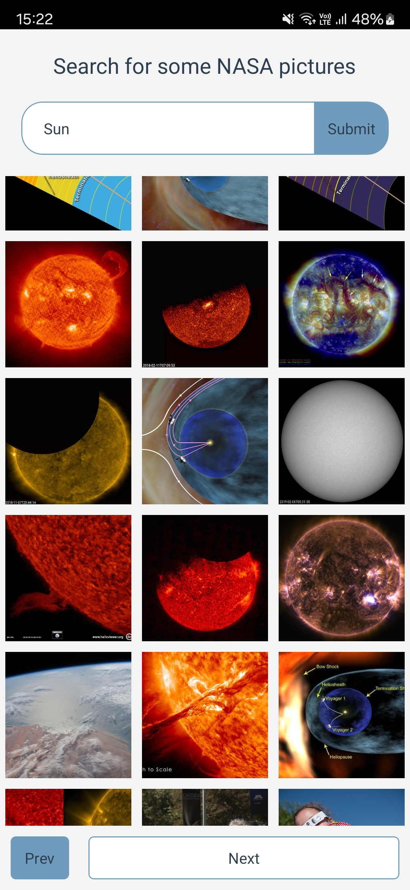
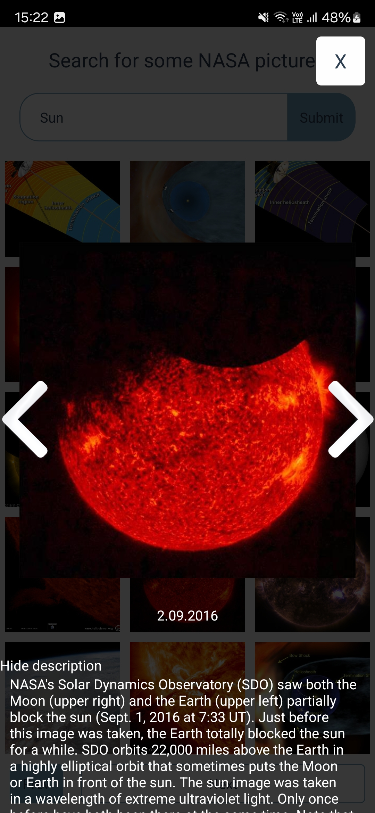

# Welcome to Space App 🌍🪐☄️🌌

Space App is a mobile application built with **React Native** and **Expo**, designed for space enthusiasts. It works in both light and dark modes**, and supports portrait and landscape orientations.

This app allows you to:
- 📸 View the **Astronomy Picture of the Day** (APOD) with description  
- 🚀 Browse **Curiosity Rover** images from selected days on Mars  
- 🌌 Search for any topic in **NASA open image resources**  


---

| Dark Menu | APOD Example | Mars Photos |
|--|--|--|
|  |  |  |

| Mars Fullscreen | Landscape Support | NASA Resources |
|--|--|--|
|  |  |  |

| Description View |
|--|
|  |

---

## 🚀 Get Started

1. **Install dependencies**
   ```bash
   npm install
   ```

2. **Create `.env` file** and add your [NASA API key](https://api.nasa.gov/):
   ```
   NASA_API_KEY=your_api_key_here
   EXPO_PUBLIC_ORIGIN=https://api.nasa.gov
   ```

3. **Set up environment variables**  
   Make sure you have the correct paths for:
   - `ANDROID_HOME`
   - `JAVA_HOME`

4. **Connect your device**  
   Enable **USB debugging** and connect your Android phone or emulator.

5. **Run the app**
   ```bash
   npx expo run:android
   ```

---

## 🛠 Technologies Used

- [React Native](https://reactnative.dev/)
- [Expo](https://expo.dev/)
- [React Query](https://tanstack.com/query/v4)
- [Axios](https://axios-http.com/)
- [NASA Open APIs](https://api.nasa.gov/)

---

