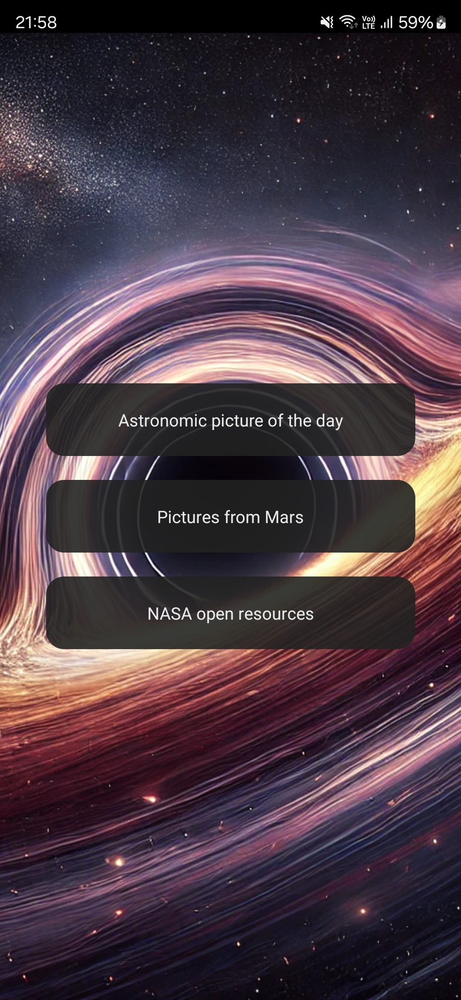
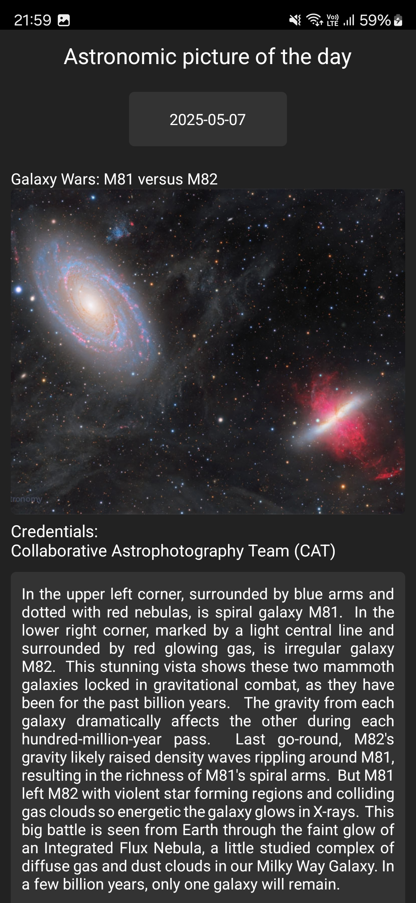
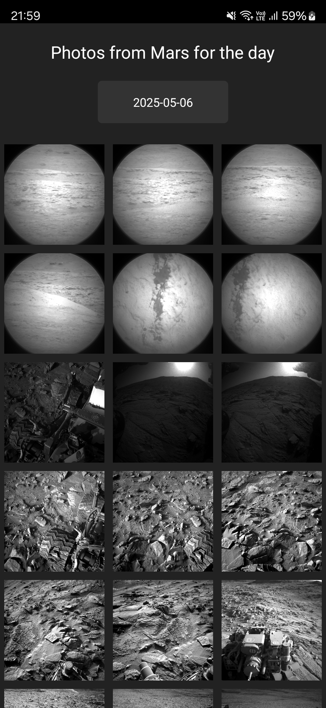
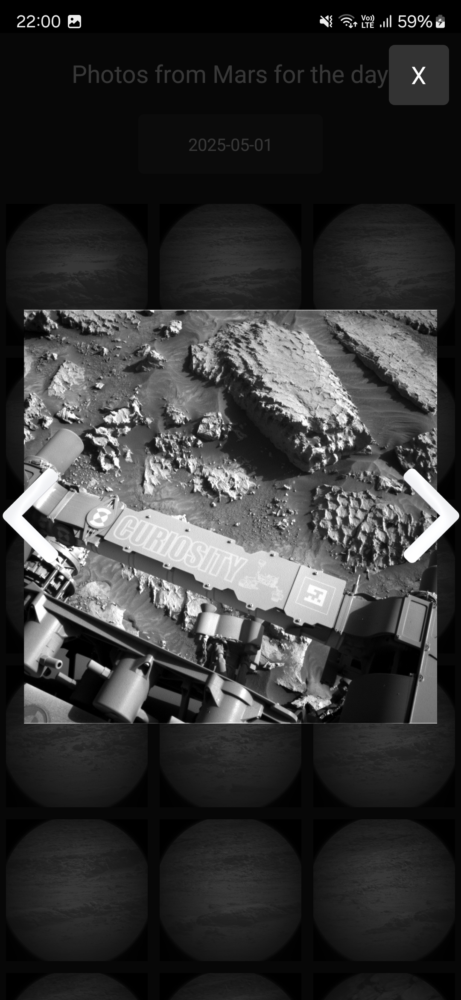
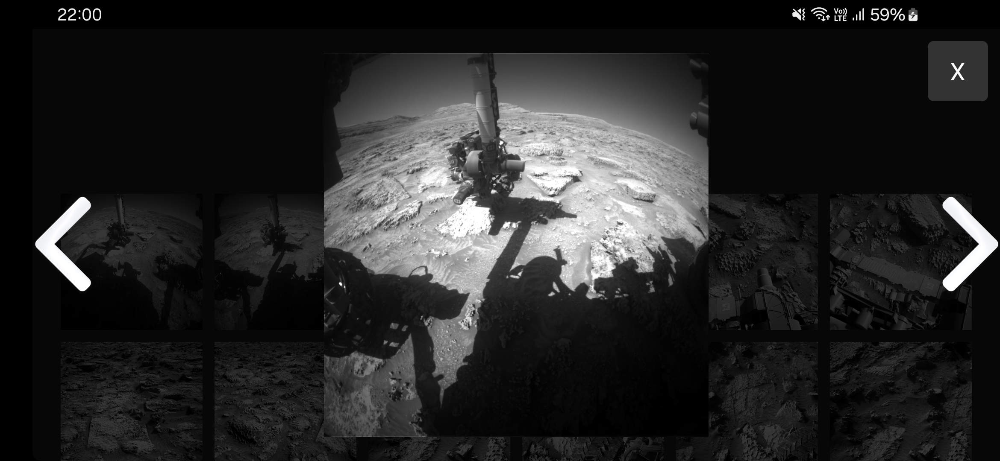

# Welcome to Space App 🌍🪐☄️🌌










also work in Landscape mode


## Get started

1. Install dependencies

   ```bash
   npm install
   ```

3. Create .env file and insert your Nasa API key .env
4. Check if you have the correct environment variables like ANDROID_HOME or JAVA_HOME set
5. Connect your device with USB debugging enabled
6. Start the app
   ```bash
    npx expo run:android
   ```
